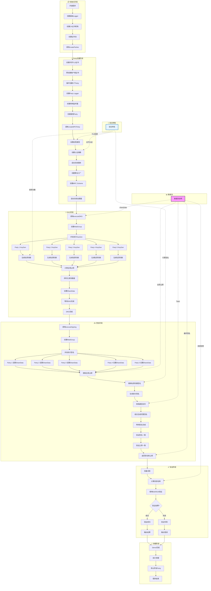

# EdDSA阈值签名系统流程图 (版本2)

基于对`eddsa_demo.go`代码的深入分析，以下是EdDSA阈值签名系统的完整工作流程图。

## 🚀 完整流程图

## 📋 流程图详细说明

### **🚀 主要阶段**

#### **1. 初始化阶段**
- **创建基础Logger**: 设置日志系统用于调试和监控
- **创建CA证书机构**: 生成证书颁发机构用于TLS证书管理
- **创建证书池**: 建立信任的证书池用于TLS连接验证
- **调用createParties**: 开始创建参与阈值签名的各方

#### **2. Party创建阶段**
- **创建共享TLS证书**: 统一TLS证书管理，避免认证问题
- **预创建客户端证书**: 提前创建所有客户端证书，按需分配
- **循环创建5个Party**: 创建5个参与方，满足4/5门限要求
- **创建Party Logger**: 为每个Party创建独立的日志记录器
- **创建网络监听器**: 每个Party创建网络监听端口
- **创建通信Party**: 建立Party间的通信基础设施
- **设置远程通信**: 配置Party间的网络连接
- **创建认证函数**: 基于客户端证书的身份验证机制
- **启动消息服务**: 建立消息接收和处理机制
- **创建算法工厂**: 创建KeyGen和Sign算法实例
- **创建MPC Scheme**: 初始化LoudScheme用于多方计算
- **启动消息处理器**: 开始处理Party间的消息交换

#### **3. DKG阶段 (分布式密钥生成)**
- **调用executeDKG**: 开始分布式密钥生成过程
- **创建WaitGroup**: 同步机制确保所有Party完成DKG
- **并发执行KeyGen**: 5个Party同时执行密钥生成协议
- **生成私钥份额**: 每个Party生成自己的私钥份额
- **计算全局公钥**: 所有Party协作计算单一的全局公钥
- **序列化保存数据**: 将密钥信息序列化为LocalPartySaveData格式
- **设置ShareData**: 将生成的密钥数据保存到对应Party
- **等待DKG完成**: 同步等待所有Party完成密钥生成
- **DKG完成**: 返回包含所有密钥信息的数组

#### **4. 签名阶段**
- **调用executeSigning**: 开始阈值签名过程
- **创建WaitGroup**: 同步机制确保所有Party完成签名
- **并发执行签名**: 5个Party同时参与签名协议
- **设置ShareData**: 每个Party加载之前保存的密钥数据
- **获取全局公钥**: 从密钥数据中提取全局公钥
- **使用私钥份额签名**: 每个Party使用自己的私钥份额进行部分签名
- **生成部分签名**: 生成需要组合的部分签名
- **网络通信协作**: 通过Topic标识符进行Party间协作
- **组合生成完整签名**: 将部分签名组合成完整的阈值签名
- **等待签名完成**: 同步等待所有Party完成签名过程
- **验证签名一致**: 确保所有Party生成相同的签名
- **验证公钥一致**: 确保所有Party计算出的公钥相同
- **返回签名和公钥**: 返回可用于验证的签名和公钥

#### **5. 验证阶段**
- **准备消息**: 准备要签名的消息 "Hello, Threshold EdDSA!"
- **计算消息哈希**: 使用SHA256计算消息的哈希值
- **使用Ed25519验证**: 使用标准Ed25519库验证生成的签名
- **验证结果判断**: 判断签名验证是否成功
- **输出结果**: 显示验证成功或失败的信息
- **输出详细信息**: 显示消息、公钥和签名的十六进制表示

#### **6. 清理阶段**
- **Demo完成**: 标志演示程序成功完成
- **执行清理**: 开始资源清理过程
- **停止所有Party**: 关闭所有Party的网络连接和资源
- **程序结束**: 优雅退出程序

### **🔐 关键安全特性**

#### **1. 门限签名**
- **需要4/5 Party协作**: 至少需要4个Party参与才能生成有效签名
- **防止单点故障**: 单个Party被攻破不会泄露完整私钥
- **提高安全性**: 分散决策权，提高系统整体安全性

#### **2. 密钥分散**
- **私钥份额分布式存储**: 完整私钥被分成5个份额分散存储
- **本地秘密**: 每个Party只知道自己的私钥份额
- **无法独立签名**: 单个Party无法独立生成有效签名

#### **3. TLS加密**
- **所有通信加密**: Party间的所有网络通信都使用TLS加密
- **防止窃听**: 保护通信内容不被第三方窃听
- **数据完整性**: 确保传输数据不被篡改

#### **4. 证书认证**
- **双向身份验证**: 客户端和服务器端都进行证书验证
- **防止中间人攻击**: 确保通信双方的身份真实性
- **统一证书管理**: 使用共享CA和预创建证书简化管理

### **📊 重要数据流**

#### **shareData数组**
- **内容**: 包含私钥份额和全局公钥的序列化数据
- **格式**: LocalPartySaveData的JSON序列化
- **作用**: 在DKG和签名阶段之间传递密钥信息
- **安全性**: 包含敏感的私钥信息，需要安全存储

#### **Topic标识符**
- **用途**: 用于标识不同签名会话的唯一标识符
- **值**: "test-signing-1" (在演示中使用固定值)
- **作用**: 确保消息正确路由到对应的签名实例
- **实际应用**: 应该基于业务逻辑生成唯一值

#### **全局公钥**
- **特性**: 所有Party计算出的相同公钥
- **来源**: DKG阶段由所有Party协作计算
- **用途**: 用于最终验证生成的阈值签名
- **一致性**: 所有Party返回的公钥必须完全相同

#### **最终签名**
- **格式**: 符合EdDSA标准的签名格式
- **特性**: 由至少4个Party协作生成
- **验证**: 可以使用标准Ed25519库验证
- **安全性**: 具有与标准EdDSA相同的安全性

#### **消息哈希**
- **算法**: SHA256
- **输入**: 原始消息 "Hello, Threshold EdDSA!"
- **用途**: 作为签名算法的输入
- **安全性**: 确保消息完整性，防止篡改

## 🎯 系统优势

### **安全性**
- **密钥分散**: 私钥分散存储，单点攻破风险低
- **门限机制**: 需要多方协作，提高攻击难度
- **标准算法**: 使用EdDSA标准算法，安全性有保障
- **加密通信**: TLS加密保护所有网络通信

### **可用性**
- **容错性**: 可以容忍1个Party失效(4/5门限)
- **并发处理**: 所有Party并行工作，提高效率
- **标准验证**: 生成的签名可以用标准库验证
- **灵活配置**: 可以调整Party数量和门限值

### **可扩展性**
- **模块化设计**: 各个组件职责清晰，易于扩展
- **网络抽象**: 通信层抽象，支持不同网络实现
- **算法插件**: 支持不同的签名算法
- **配置灵活**: 可以根据需要调整系统参数

这个流程图展示了完整的EdDSA阈值签名系统，从初始化到最终验证的全过程，体现了分布式密钥管理和门限签名的核心概念。系统通过多方协作实现了高安全性的阈值签名，同时保持了良好的可用性和可扩展性。